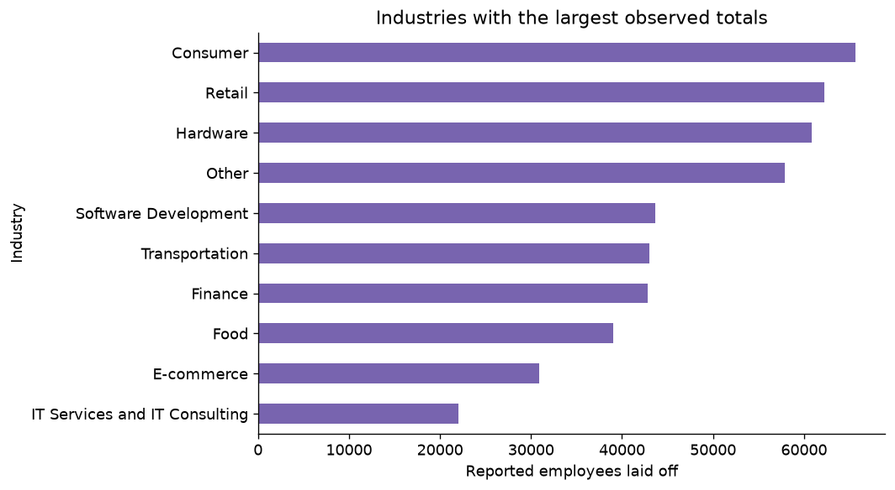
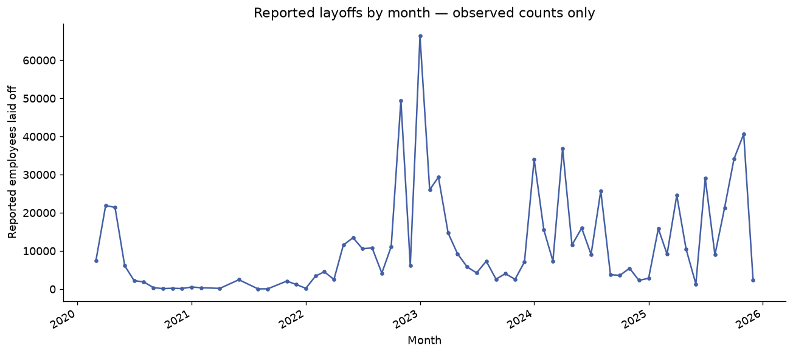

# Technology Layoffs: Trends and Coverage

Built a reproducible analysis of 2,412 reported technology-layoff records, with monthly, industry and geographic views. Audited missing counts and reported observed totals separately from data coverage instead of filling missing events with invented numbers. Produced reusable tables and visualizations for a data-storytelling article, with clear limits on completeness and causal interpretation.

## Telling the layoffs story without inventing missing events

A layoff chart can look precise even when many reports omit the number of people affected. This project asks how reported layoffs vary over time and across industries while keeping the gaps visible.

The revised pipeline validates dates and counts, aggregates observed records and reports how many events contain a known count. It does not fill unknown layoff sizes with a median or pretend they are zero.

The resulting figures describe 746,809 reported layoffs in this snapshot. They support a story about the file’s observed patterns, with reporting coverage and causal limits stated alongside the charts.

## Status

Executed successfully; measured results saved.

## Method

Validated dates and layoff counts, removed exact duplicates, and produced monthly, annual, industry and country summaries. Missing event counts remain missing; aggregate tables explicitly track coverage. No median or zero imputation is used to invent missing layoffs.

## Measured results

See `results/metrics.json` and the accompanying aggregate CSV files for all measured findings.

## Limits and interpretation

The snapshot has 2,412 records from March 2020 to December 2025 and 372 missing layoff counts. Its observed total of 746,809 represents reported counts within this file, not a complete estimate of worldwide layoffs. Temporal and industry differences can reflect reporting coverage; they do not establish causes.

## Data

Supply the local tech_layoffs_til_2025.csv snapshot. Expected columns include Company, Date_layoffs, Laid_Off, Industry and Country. Dataset completeness and original licensing have not been independently established.

## Reproduce

Run from this project directory in an isolated Python environment. The tabular projects were executed with Python 3.12; the deep-learning projects used Python 3.11 on CPU.

```shell
python -m venv .venv
# Activate .venv using your shell's activation command.
python -m pip install -r requirements.txt
python analyze.py --data data/tech_layoffs_til_2025.csv --out results
```

`analysis.ipynb` is an executed results-review notebook. It displays saved outputs by default; its optional training cell can rerun the experiment after the dataset path is configured. Training scripts were executed separately to produce the recorded results. Raw datasets, downloaded encoders and trained model files are excluded from Git. Only load model files you created or trust.

## Files

- `train.py` or `analyze.py`: complete experiment or analysis.
- `common.py`: metric, figure and reproducibility helpers.
- `results/metrics.json`: measured outcomes, data fingerprint and environment.
- `results/*.csv` and `results/*.png`: aggregate tables and figures.
- `analysis.ipynb`: reproducible review and optional rerun instructions.
- `project-description.md`: LinkedIn-ready description and skills.

## Figures





## Attribution

Portfolio project by Nourah Alotaibi. This package refactors the collected project into a new reproducible workflow. Dataset providers, upstream libraries and pretrained-model authors retain their respective rights. This repository does not grant a new license to third-party data or models.
