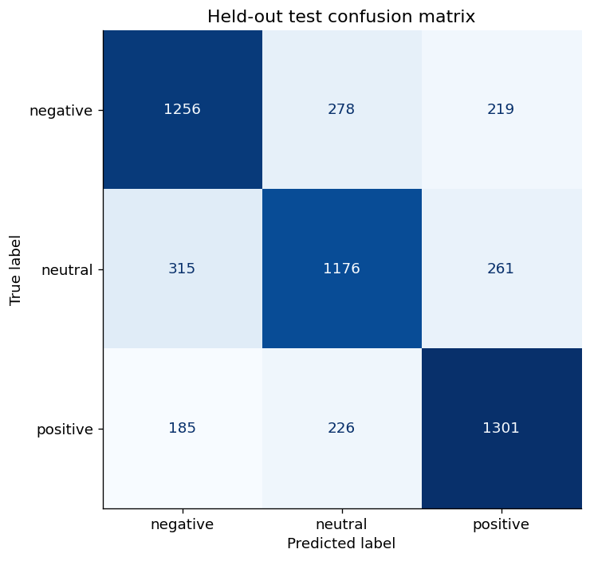
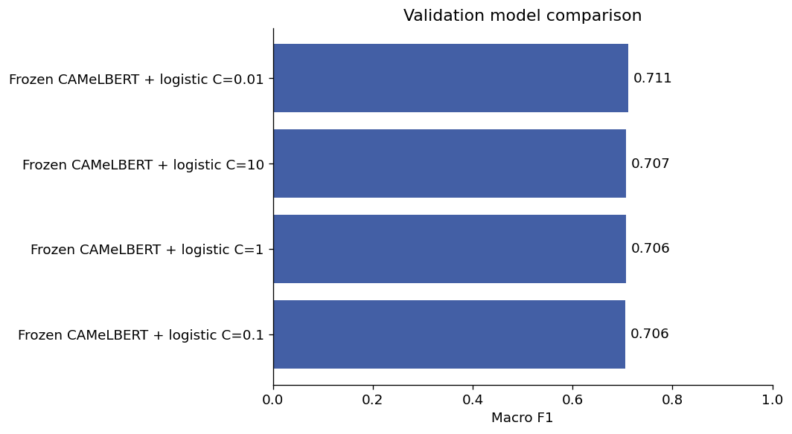

# Arabic Transformer Features for Sentiment Classification

Built an Arabic sentiment experiment using pretrained CAMeLBERT embeddings and a supervised classification head. Reused the duplicate-cleaned split from the classical NLP benchmark for a transparent comparison. Added masked pooling, validation-based regularization, CPU quantization and explicit documentation of the distinction between frozen-feature transfer learning and end-to-end fine-tuning. The selected model achieved 71.55% held-out accuracy and 0.715 macro F1. Accuracy was 0.71 percentage points above the classical TF-IDF model on the same test set; no statistically significant advantage is claimed.

## Does a pretrained Arabic encoder help this sentiment task?

A pretrained language model does not automatically become a trained sentiment classifier. This project turns the transformer notebook into an explicit supervised experiment and asks how transferable Arabic representations perform on the same task used by the classical baseline.

CAMeLBERT provides frozen text representations; a separate logistic classifier learns the labels. CPU quantization lowers inference cost, and validation selects regularization before the held-out evaluation.

The comparison is reported even if the transformer does not beat the simpler TF-IDF approach. Understanding the tradeoff in accuracy, complexity and compute is part of the project’s value.

## Status

Executed successfully; measured results saved.

## Method

Replaced untrained classification-head inference with a supervised sentiment classifier over frozen CAMeLBERT dialectal-Arabic embeddings. Uses masked mean pooling, CPU int8 linear layers, a 96-token limit and validation-selected logistic-regression regularization. All classifier scaling is fitted on the training/development partition.

## Measured results

| Model | Accuracy | Balanced accuracy | Macro F1 | ROC-AUC |
|---|---:|---:|---:|---:|
| Frozen CAMeLBERT + logistic C=0.01 | 0.7155 | 0.7159 | 0.7154 | — |


## Limits and interpretation

This is a frozen encoder plus trained linear head, not end-to-end transformer fine-tuning. Pretraining-corpus overlap and dataset label provenance are unverified. The classical and transformer results use the same task and partition but different text representations. A more complex model is not automatically a stronger result.

## Data

First run project 03 to create its locally ignored prepared.csv. This project reuses the exact deduplicated texts and train/validation/test assignment. It downloads the pretrained encoder from https://huggingface.co/CAMeL-Lab/bert-base-arabic-camelbert-da . Internet access and about 439 MB for encoder weights are required; no paid API is used.

## Reproduce

Run from this project directory in an isolated Python environment. The tabular projects were executed with Python 3.12; the deep-learning projects used Python 3.11 on CPU.

```shell
python -m venv .venv
# Activate .venv using your shell's activation command.
python -m pip install -r requirements.txt
python train.py --data ../03-arabic-sentiment/data/prepared.csv --out results
```

`analysis.ipynb` is an executed results-review notebook. It displays saved outputs by default; its optional training cell can rerun the experiment after the dataset path is configured. Training scripts were executed separately to produce the recorded results. Raw datasets, downloaded encoders and trained model files are excluded from Git. Only load model files you created or trust.

## Files

- `train.py` or `analyze.py`: complete experiment or analysis.
- `common.py`: metric, figure and reproducibility helpers.
- `results/metrics.json`: measured outcomes, data fingerprint and environment.
- `results/*.csv` and `results/*.png`: aggregate tables and figures.
- `analysis.ipynb`: reproducible review and optional rerun instructions.
- `project-description.md`: LinkedIn-ready description and skills.

## Figures





## Attribution

Portfolio project by Nourah Alotaibi. This package refactors the collected project into a new reproducible workflow. Dataset providers, upstream libraries and pretrained-model authors retain their respective rights. This repository does not grant a new license to third-party data or models.
