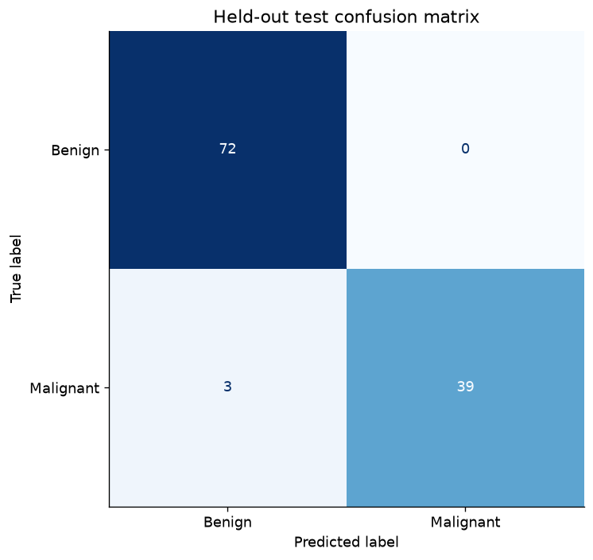

# Breast-Cancer Diagnostic Benchmark with Scaled SVMs

Developed a reproducible classification benchmark on the Wisconsin Diagnostic Breast Cancer dataset. Used fold-local scaling and cross-validation to select an SVM, then achieved 97.37% accuracy on a held-out 114-record test set compared with 92.11% for an unscaled linear-SVM baseline. Included class-level evaluation, an accuracy confidence interval and clear limits on clinical interpretation.

## Testing whether scale changes the SVM result

SVMs depend on feature geometry, so measurements on different scales can affect what the model learns. This educational benchmark asks how fold-local scaling and model selection change classification performance.

An unscaled linear-SVM baseline is compared with scaled candidates, selected only through training cross-validation. The final 114-case test set is used to report performance and an accuracy interval.

The scaled model improves the held-out result, but a small benchmark cannot establish clinical reliability. The project demonstrates sound experimental practice and clear boundaries around its claims.

## Status

Executed successfully; measured results saved.

## Method

Compared an unscaled linear-SVM baseline with scaled SVM/logistic candidates. Fitted scaling within each training fold, selected hyperparameters by five-fold training ROC-AUC, and evaluated once on a held-out 114-record test set.

## Measured results

| Model | Accuracy | Balanced accuracy | Macro F1 | ROC-AUC |
|---|---:|---:|---:|---:|
| Unscaled linear SVM baseline | 0.9211 | 0.9028 | 0.9128 | 0.9917 |
| Selected scaled model | 0.9737 | 0.9643 | 0.9713 | 0.9957 |


## Limits and interpretation

Selected test accuracy is 97.37% (111/114), with a Wilson 95% interval of approximately 92.55%–99.10%. The same-split unscaled baseline reached 92.11%. This is a small educational benchmark and has no clinical validation; it must not be represented as a diagnostic product.

## Data

Uses the Wisconsin Diagnostic Breast Cancer benchmark included in scikit-learn. Documentation: https://scikit-learn.org/stable/modules/generated/sklearn.datasets.load_breast_cancer.html . Target is explicitly remapped to 1 = malignant.

## Reproduce

Run from this project directory in an isolated Python environment. The tabular projects were executed with Python 3.12; the deep-learning projects used Python 3.11 on CPU.

```shell
python -m venv .venv
# Activate .venv using your shell's activation command.
python -m pip install -r requirements.txt
python train.py --out results
```

`analysis.ipynb` is an executed results-review notebook. It displays saved outputs by default; its optional training cell can rerun the experiment after the dataset path is configured. Training scripts were executed separately to produce the recorded results. Raw datasets, downloaded encoders and trained model files are excluded from Git. Only load model files you created or trust.

## Files

- `train.py` or `analyze.py`: complete experiment or analysis.
- `common.py`: metric, figure and reproducibility helpers.
- `results/metrics.json`: measured outcomes, data fingerprint and environment.
- `results/*.csv` and `results/*.png`: aggregate tables and figures.
- `analysis.ipynb`: reproducible review and optional rerun instructions.
- `project-description.md`: LinkedIn-ready description and skills.

## Figures



## Attribution

Portfolio project by Nourah Alotaibi. This package refactors the collected project into a new reproducible workflow. Dataset providers, upstream libraries and pretrained-model authors retain their respective rights. This repository does not grant a new license to third-party data or models.
