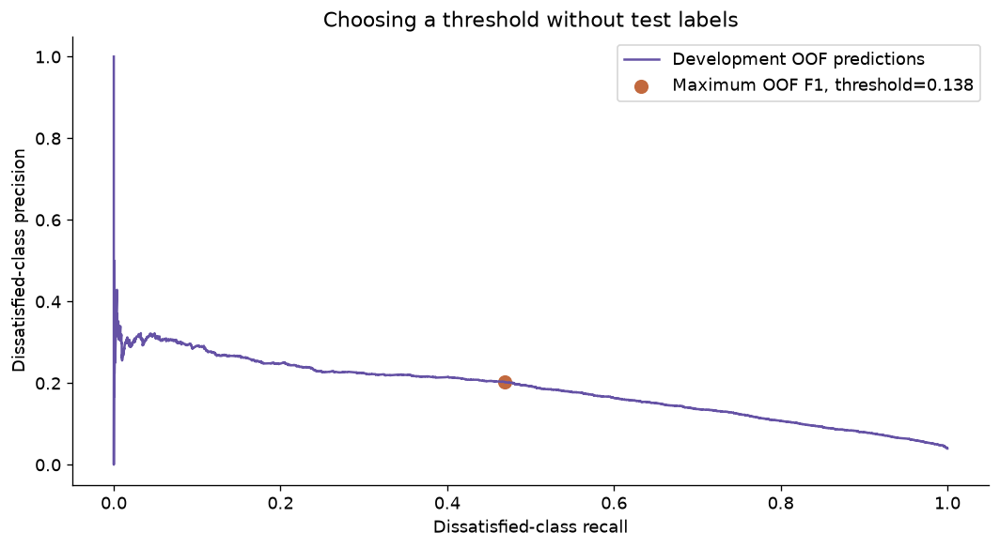
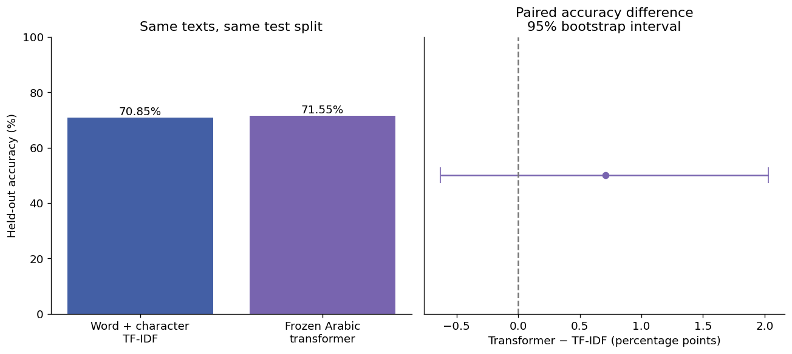

# Additional evaluation findings

## Customer satisfaction: turn ranking into an explicit decision

The original model at threshold 0.5 flagged only 2 of the 602 dissatisfied test examples. A follow-up chose an illustrative threshold of **0.1376** by maximizing minority-class F1 on four-fold, group-disjoint out-of-fold development predictions. Test labels did not choose the threshold.

| Operating point | Dissatisfied recall | Dissatisfied precision | Overall accuracy | Flagged records |
|---|---:|---:|---:|---:|
| Default 0.5 | 0.33% | 100.00% | 96.05% | 2 |
| Development-selected F1 threshold | 45.02% | 21.02% | 91.13% | 1289 |

The new threshold finds 271 of 602 dissatisfied examples but also flags 1,018 satisfied examples. Balanced accuracy increases to 0.690 and minority-class F1 to 0.287. ROC-AUC stays unchanged because only the decision rule changes. This makes the precision/recall tradeoff explicit; it is not a validated business-cost policy.

**Evaluation boundary:** this is a follow-up on the previously reported test set, not fresh independent validation. The selection procedure uses development data only, but a future deployment should validate the rule on a new period.

```shell
python threshold_analysis.py --data data/train.csv --model models/model.joblib --out results
python predict.py --input data/new_customers.csv --threshold 0.137553 --output predictions.csv
```




Full metrics: `results/threshold_analysis.json` and `results/threshold_test_comparison.csv`.


## Arabic sentiment: compare the same test examples

The transformer was correct on 653 examples where TF-IDF was wrong, while TF-IDF was correct on 616 examples where the transformer was wrong. Both were correct on 3080 and both were wrong on 868.

The accuracy difference is **+0.71 percentage points**. Its paired row-bootstrap 95% interval is **−0.63 to +2.03 percentage points**, and the exact two-sided McNemar p-value is **0.312**. This does not establish a clear advantage for either approach.

This is a post-hoc comparison of fixed, already reported models. Row-wise statistical calculations assume independent examples; author and time dependencies are unknown, and multiple comparisons across other experiments are not corrected.



Full counts and methods: `results/paired_comparison.json`. `compare_predictions.py` reproduces the comparison from local prediction arrays and the shared fixed split; raw texts and per-row predictions are excluded from Git.
