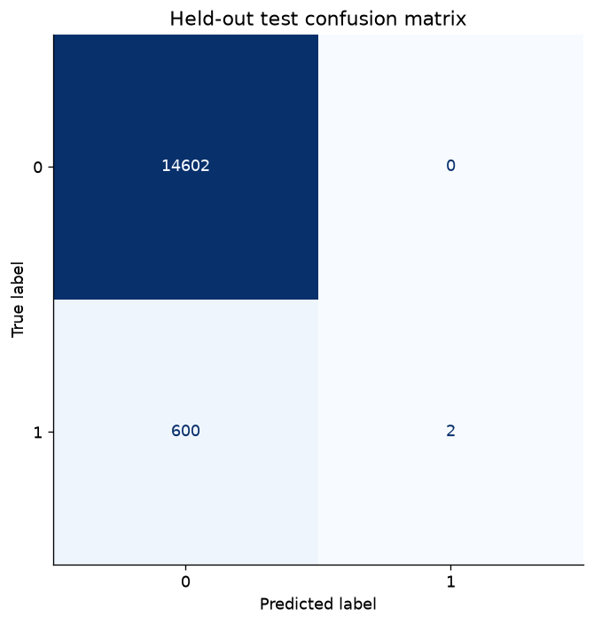
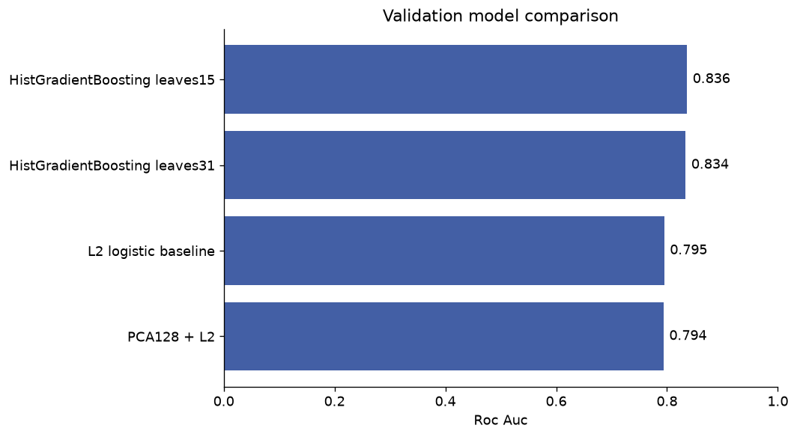
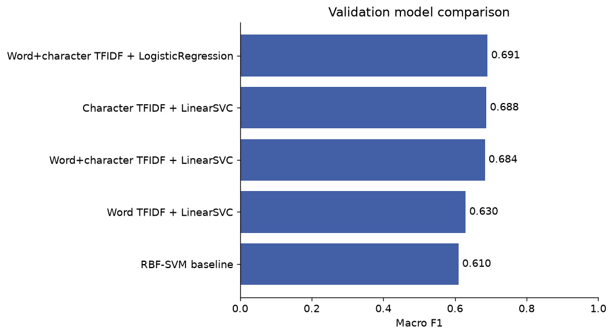
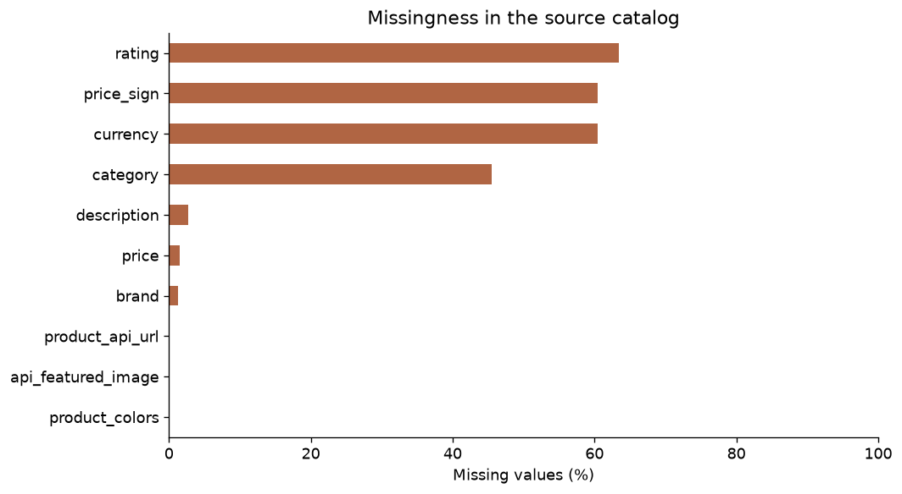
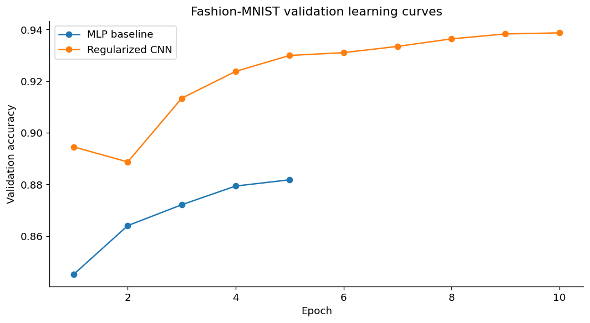
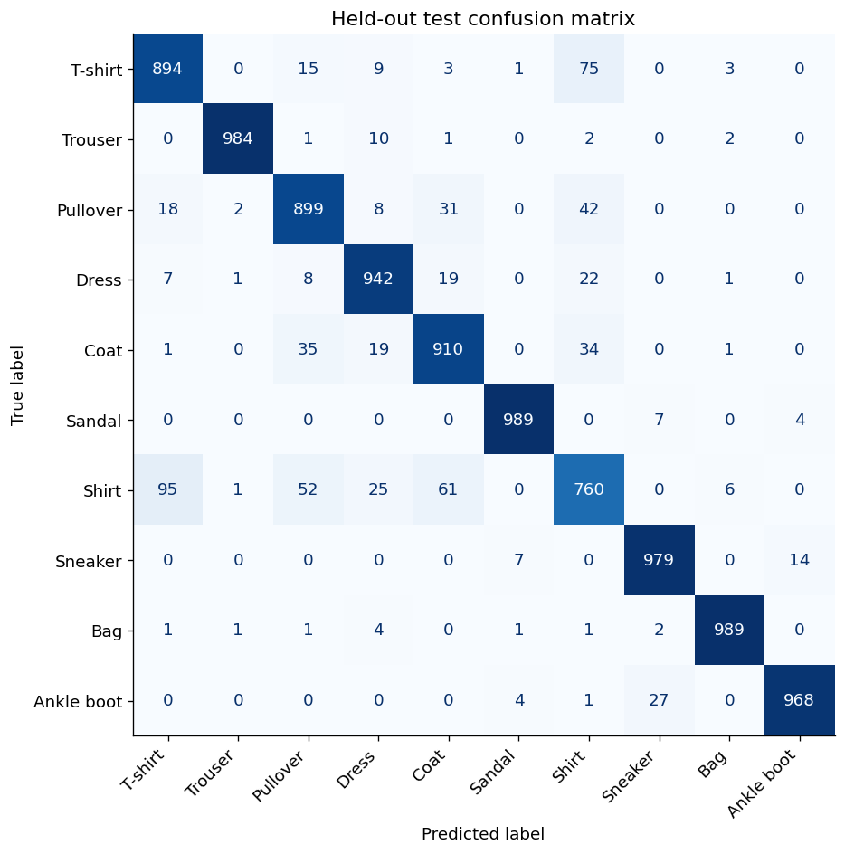
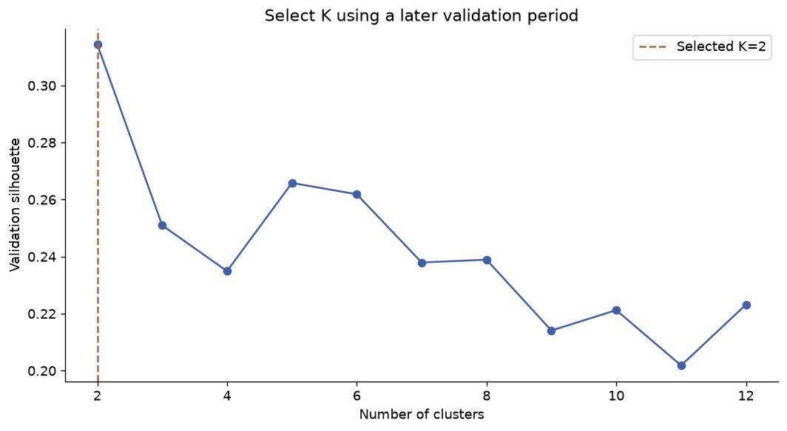
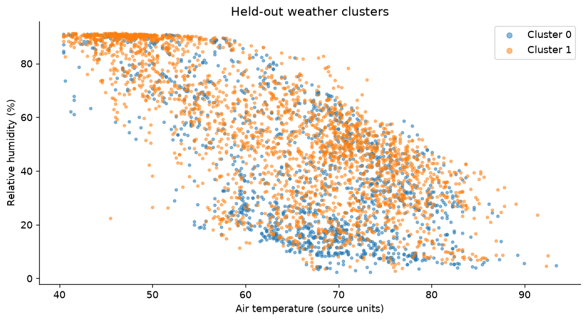
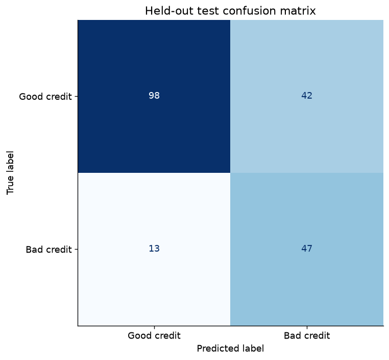

# Applied AI and Data Science — Nourah Alotaibi

This portfolio follows a recurring question: **what makes a result credible enough to share?** Across Arabic NLP, customer modeling, computer vision and exploratory analysis, the work moves from notebooks toward reproducible experiments, inspectable figures and honest interpretation.

The strongest story is not a collection of isolated accuracy scores. It is the process behind them: protecting evaluation splits, questioning incomplete data, comparing simple and complex approaches, and making the remaining limitations visible.

## Featured repositories

- [Customer satisfaction: PCA, regularization and boosting](https://github.com/Nourah-Alotaibi/customer-satisfaction-pca-benchmark)
- [Arabic sentiment: word and character features](https://github.com/Nourah-Alotaibi/arabic-sentiment-classification)

## Project stories and figures

### 1 — When 96% accuracy is not enough

Most records describe satisfied customers. A classifier could predict the majority class every time and look impressive on accuracy while missing nearly every dissatisfied customer. The useful question is whether the model can rank the rarer cases above the rest.

The experiment starts with regularized logistic regression, tests whether PCA helps, then compares boosting. Duplicate predictor rows are kept together across splits so memorized copies cannot inflate test performance.

[Full project, results and reproduction instructions](01-customer-satisfaction/README.md)

### 3 — Finding sentiment in Arabic spelling variation

A short Arabic post may mix spelling variants, negation, emoji and informal language. A small word vocabulary can miss useful clues. The question is whether combining word meaning with character patterns improves a reproducible sentiment baseline.

Normalization keeps negation and emoji; duplicate and conflicting texts are checked before splitting. Five models compete on validation macro F1, with the test set reserved for the final comparison.

[Full project, results and reproduction instructions](03-arabic-sentiment/README.md)

### 7 — What a cosmetics catalog can—and cannot—tell us

A cosmetics catalog looks like a natural place to compare brands, prices and ratings. But a chart is only as credible as the records behind it. This project begins by asking which comparisons the available fields actually support.

The revised workflow audits coverage, preserves missing values and separates currencies before summarizing products. Brand and product-type charts describe catalog coverage, while the missingness chart explains the limits of price and rating analysis.

[Full project, results and reproduction instructions](07-cosmetics/README.md)

### 8 — Telling the layoffs story without inventing missing events

A layoff chart can look precise even when many reports omit the number of people affected. This project asks how reported layoffs vary over time and across industries while keeping the gaps visible.

The revised pipeline validates dates and counts, aggregates observed records and reports how many events contain a known count. It does not fill unknown layoff sizes with a median or pretend they are zero.

[Full project, results and reproduction instructions](08-tech-layoffs/README.md)

### 9 — From recognizing simple shapes to separating similar clothes

A pullover, coat and shirt can look similar in a 28×28 grayscale image. This project asks whether a regularized convolutional model can learn more useful visual features than a simple dense-network baseline.

A fixed validation split selects checkpoints. Batch normalization, dropout, AdamW and a learning-rate schedule are added to the CNN, and training statistics are learned without using the official test set.

[Full project, results and reproduction instructions](09-fashion-mnist/README.md)

### 10 — Does a pretrained Arabic encoder help this sentiment task?

A pretrained language model does not automatically become a trained sentiment classifier. This project turns the transformer notebook into an explicit supervised experiment and asks how transferable Arabic representations perform on the same task used by the classical baseline.

CAMeLBERT provides frozen text representations; a separate logistic classifier learns the labels. CPU quantization lowers inference cost, and validation selects regularization before the held-out evaluation.

[Full project, results and reproduction instructions](10-arabic-transformers/README.md)

### 16 — Discovering weather patterns without assuming twelve clusters

Minute-level weather records contain cycles, missing measurements and directional values. The question is whether a small set of repeatable patterns appears in a later time period, rather than merely finding groups in the same records used for fitting.

Wind directions become circular sine/cosine features. The pipeline separates time periods, fits preprocessing on earlier data and compares 2–12 clusters on validation silhouette before checking the final period.

[Full project, results and reproduction instructions](16-weather-clustering/README.md)

### 17 — Why a lower accuracy can still reveal a useful tradeoff

In a credit benchmark with unequal classes, overall accuracy can hide weak detection of the minority class. This project asks how preprocessing and model selection change that tradeoff.

All encoding and scaling move inside cross-validation, then candidates are selected by balanced accuracy. A held-out test set makes the effect on both overall and class-balanced performance visible.

[Full project, results and reproduction instructions](17-german-credit/README.md)

### 18 — Testing whether scale changes the SVM result

SVMs depend on feature geometry, so measurements on different scales can affect what the model learns. This educational benchmark asks how fold-local scaling and model selection change classification performance.

An unscaled linear-SVM baseline is compared with scaled candidates, selected only through training cross-validation. The final 114-case test set is used to report performance and an accuracy interval.

[Full project, results and reproduction instructions](18-breast-cancer/README.md)

## Scope and publication status

Nine improved workflows were executed; their result-review notebooks also execute. Figures, aggregate result tables, source code and descriptions are included. Raw data, credentials, encoders and trained checkpoints are excluded from the repository. The repositories were created private for review and are not yet public portfolio links.

Private Google Drive and Colab were not accessed because Chrome control failed before connecting. Local copies and explicitly identified public sources support these results. This is therefore not a complete inventory of cloud work. Thesis, heart disease, Tulip/Sanad, telecom churn and diabetes are excluded from this upgrade.

The web-security extension is an audited prototype, not an executed scanner. Noor's description reflects its existing project documentation and credits ONEPUNCHMAN411/Jarvis. No LinkedIn post or website change has been published.

[Ready-to-edit LinkedIn descriptions, Noor, and explanations of projects 23–25](LINKEDIN-PROJECTS.md)

## Recommended LinkedIn order

These are editorial priorities based on the inspected evidence, not an objective score of project quality.

| Priority | Project | Why |
|---:|---|---|
| 1 | Noor desktop assistant | Strongest product-engineering story, with clear upstream credit. Its existing documentation was used; no new end-to-end demo was recorded. |
| 2 | Arabic sentiment — classical + transformer comparison | Strongest NLP story: controlled shared evaluation, Arabic-specific text handling, 70.85% and 71.55% test accuracy. Present these as one comparative case study. |
| 3 | Customer-satisfaction benchmark | Strongest tabular-model evaluation story: ROC-AUC 0.836 and explicit class-imbalance limitations. |
| 4 | Fashion-MNIST CNN | Clear computer-vision experiment with 93.14% test accuracy and useful class-level figures; the task is a common benchmark. |
| 5 | Cosmetics catalog analysis | Distinctive blog topic and strong data-quality narrative. The private cloud version is still uninspected. |
| 6 | Weather clustering | Good unsupervised-learning evidence with temporal validation, circular features and stability checks. |
| 7 | Tech layoffs analysis | Accessible business/data storytelling with transparent missing-count coverage. |
| 8 | German credit benchmark | Useful pipeline and evaluation tradeoff study; lower priority because the dataset is common and historical. |
| 9 | Breast-cancer benchmark | Supports ML fundamentals; keep the small-sample and nonclinical boundaries explicit. |
| 10 | Web-security extension | Potentially distinctive applied project, but integration and browser execution remain unverified. |
| 11 | YOLO tutorials | Keep as learning material until a custom detector and measurements exist. |
| 12 | NLP coursework and NumPy neural networks | Good attributed educational articles; do not present downloaded tutorials or toy examples as original production systems. |
